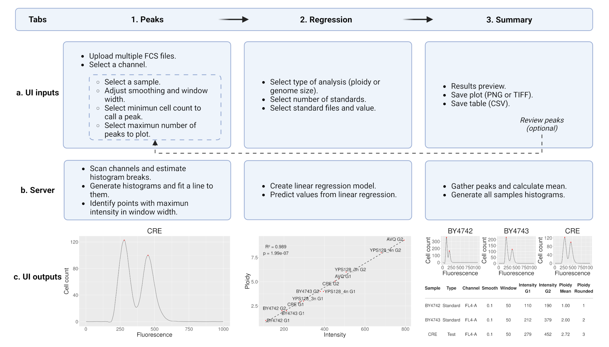

# MuPET-Flow: Multiple Ploidy Estimation Tool for all Species Compatible with Flow Cytometry

Created: January 30, 2023

Updated: December 17, 2024

Authors: Gómez-Muñoz, C.* and Fischer, G.

*cintia.gomez_munoz@sorbonne-universite.fr

---

## Introduction

This is the source repository for `MuPETFlow`.

**MuPETFlow** is a graphical user interface (GUI) tool designed to estimate ploidy from DNA cells stained with fluorescent dyes and analyzed via flow cytometry. It automates the processes of file uploading and configuration, peak fluorescence intensity detection, multiple histogram visualizations, peak error curation, ploidy and genome size calculations, and result exportation.


If you encounter any bugs or issues, please feel free to report them.

## Installation and Prerequisites

To run MuPETFlow, you need **R** and optionally **RStudio**. Below are links to their download pages and installation instructions:

* [R](https://cran.r-project.org/)
* [RStudio](https://posit.co/download/rstudio-desktop/)

MuPETFlow can be installed from **The Comprehensive R Archive Network (CRAN)**:

```r
install.packages("MuPETFlow")
```

Alternatively, to install the latest development version directly from **GitHub**, use:

```r
remotes::install_github("CintiaG/MuPET-Flow")
```

The installation process automatically handles all CRAN dependencies. However, this package also depends on the **Bioconductor** package `flowCore`, which is not managed via `install.packages()`. If not already installed, install it manually by running:

```r
if (!requireNamespace("BiocManager", quietly = TRUE)) {
    install.packages("BiocManager")
}
BiocManager::install("flowCore")
```

See [Dependencies](#Dependencies) below if you encounter any issues.

## How to run MuPETFlow

Load the `MuPETFlow` library.

```r
library(MuPETFlow)
```

Once **MuPETFlow** is installed, you can run the application using the following function:

```r
runMuPETFlow()
```

## Description

Once the application is launched, you can either:
1. Load your experimental data.
2. Run an in-app example by clicking the 'Example' button.

Notes:
* For the first case, selecting the channel where the data was acquired is mandatory.
* If you choose the second, the tool will download the example files in a temporary file. This process requires internet connection and might take a few minutes. Then, the example channel `FL4-A` is automatically detected for demonstration purposes.

After launching the app, you can follow the app flow, which is divided into three tabs: _**Peaks**_, _**Regression**_ and _**Summary**_.  Below is a general description of the options available in each tab:



### Peaks

* **Select a sample (optional):** Allows visual exploration of individual samples if desired.
* **Adjust smoothing (optional):** Adjusts the histogram curve for noisy samples.
* **Adjust window width (optional):** Defines the interval where the app will look for peaks.
* **Select minimum cell count to call a peak (optional):** Useful for samples with a low number of events.
* **Select maximum number of peaks to plot (optional):** Useful for samples with heterogeneous populations where more peaks are present.

### Regression

* **Select type of analysis:** Choose between "Ploidy" or "Genome size" analysis.
* **Select number of standards:** A minimum of two different standards is required, but more are recommended.
* **Select standard samples and values:** This is the ploidy or genome size of your standards.

### Summary

* **Results preview:** Creates a compiled figure with histograms for all samples.
* **Save plot:** Saves the histograms in either PNG or TIFF format with customizable size and quality. Optionally, you can control the grid layout.
* **Save table:** Exports the parameters used and the estimated ploidy or genome size as a CSV file.

If any errors are detected in the analyzed samples, you can go back to the Peaks tab to review the parameters. Note that the regression must also be re-done after parameter adjustments.

## Dependencies

The following R libraries are required to run MuPETFlow. These are installed automatically during the setup. If automatic installation fails, you can manually install them:

* [shiny](https://shiny.posit.co/r/getstarted/shiny-basics/lesson1/index.html)
* [shinythemes](https://rstudio.github.io/shinythemes/)
* [flowCore](https://bioconductor.org/packages/release/bioc/html/flowCore.html)
* [zoo](https://CRAN.R-project.org/package=zoo)
* [ggplot2](https://ggplot2.tidyverse.org/)
* [DT](https://rstudio.github.io/DT/)
* [tidyverse](https://www.tidyverse.org/packages/)
* [ggrepel](https://CRAN.R-project.org/package=ggrepel)
* [gridExtra](https://CRAN.R-project.org/package=gridExtra)
* [markdown](https://CRAN.R-project.org/package=markdown)

On Linux platforms, you may encounter errors related to missing system libraries. To resolve this, carefully read the error messages, identify the missing libraries, and install them using your system's package manager (e.g., `apt` for Debian/Ubuntu or `yum` for CentOS/RedHat).

### Recent updates.

**December 16, 2024:** The app was prepared to be published in The Comprehensive R Archive Network (CRAN), which now installs all the dependencies automatically and provides in-app example data.

**June 14th, 2024:** A bug affecting histogram calculations for gated files was detected and fixed. Consequently, the peaks calculated with this new version may slightly differ from those generated by the previous version.

**April 12th, 2024:** Significant change in histogram calculation: All files are now converted to histograms ranging from 0 to 1000, as opposed to using the bin scale of the instrument. This modification enables quicker processing of files from newer instruments capable of storing data in larger bin sizes.

## References

Gómez-Muñoz, C., & Fischer, G. (2024). MuPET-Flow: Multiple Ploidy Estimation Tool from Flow cytometry data (p. 2024.01.24.577056). bioRxiv. https://doi.org/10.1101/2024.01.24.577056
